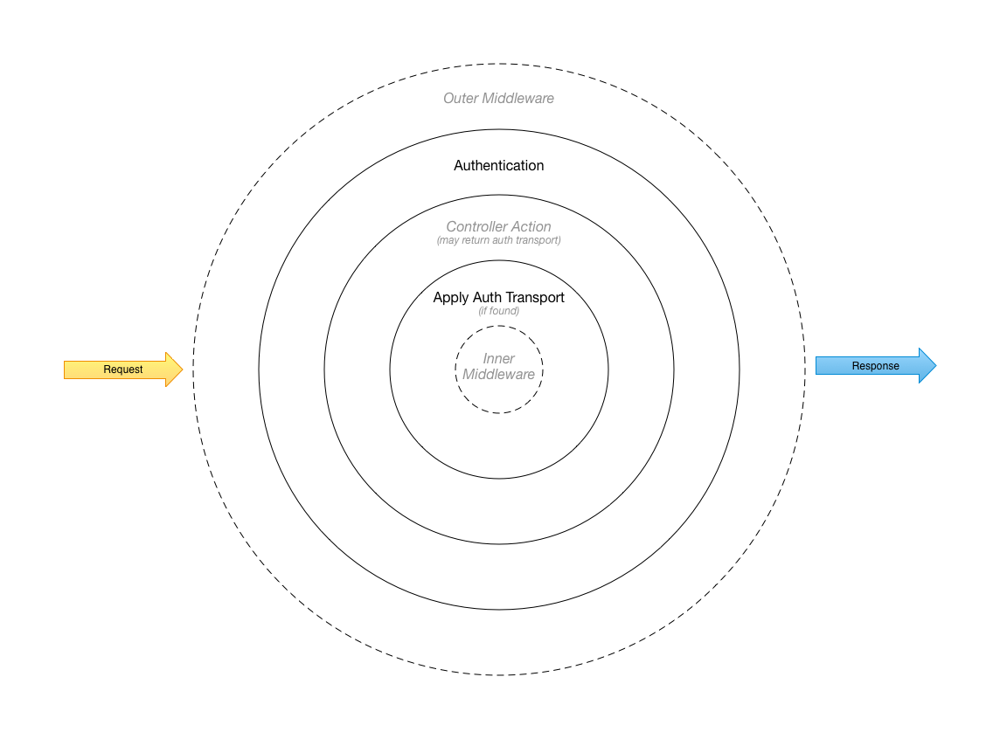

# Authentication Library

[](https://travis-ci.org/activecollab/authentication)

Table of Contents:

* [Who are Authenticated Users](#who-are-authenticated-users)
  * [Accessing Users](#accessing-users)
* [Authorizers](#authorizers)
  * [Request Aware Auhtorizers](#request-aware-auhtorizers)
  * [Exception Aware Authorizers](#exception-aware-auhtorizers)
* [Transports](#transports)
* [Events](#events)
* [Authentication Middlewares](#authentication-middlewares)
* [Working with Passwords](#working-with-passwords)
  * [Hashing and Validating Passwords](#hashing-and-validating-passwords)
  * [Password Policy](#password-policy)
  * [Generating Random Passwords](#generating-random-passwords)
* [Login Policy](#login-policy)
* [To Do](#to-do)
    
## Who are Authenticated Users?

Authentication library builds on top of `activecollab/user` package. There are three types of visitors that we recognize:

1. Unidentified visitors - Visitors that we know nothing bout,
1. Identified visitors - People that we identified when they provided their email address,
1. Users with accounts - People with actual accounts in our application.

Only users with accounts in our application can be authenticated.

### Accessing Users

Write a class that implements `ActiveCollab\Authentication\AuthenticatedUser\RepositoryInterface` when integrating this package. Implementation of this interface will let the library find users by their ID and username:

```php
<?php

namespace MyApp;

class MyUsersRepository implements \ActiveCollab\Authentication\AuthenticatedUser\RepositoryInterface
{
    /**
     * {@inheritdoc}
     */
    public function findById($user_id)
    {
        // Find and return user by ID
    }

    /**
     * {@inheritdoc}
     */
    public function findByUsername($username)
    {
        // Find and return user by username (can be an email address as well)
    }
}
```

## Authorizers

Authorizers are used to authorize user credentials against data that is stored by a particular authentication service (stored users, LDAP/AD, IdP etc).

Key authorizer method is `verifyCredentials`. It receives an array with credentials and it is expected to return `ActiveCollab\Authentication\AuthenticatedUser\AuthenticatedUserInterface` instance on successful authorization, or `null` when auhtorization is not successful. Some implementations may decide to throw exceptions, to make a clear distinction between various reasons why authorization failed (user not found, invalid password, user account is temporaly or permanently suspended etc). 

Example of Authorizer implementation that fetches user from users repository, and validates user's password:

```php
<?php

namespace MyApp;

use ActiveCollab\Authentication\Authorizer\AuthorizerInterface;
use ActiveCollab\Authentication\AuthenticatedUser\RepositoryInterface;
use ActiveCollab\Authentication\Exception\InvalidPasswordException;
use ActiveCollab\Authentication\Exception\UserNotFoundException;
use InvalidArgumentException;

class MyAuthorizer implements AuthorizerInterface
{
    /**
     * @var RepositoryInterface
     */
    private $user_repository;

    /**
     * @param RepositoryInterface $user_repository
     */
    public function __construct(RepositoryInterface $user_repository)
    {
        $this->user_repository = $user_repository;
    }

    /**
     * {@inheritdoc}
     */
    public function verifyCredentials(array $credentials)
    {
        if (empty($credentials['username'])) {
            throw new InvalidArgumentException('Username not found in credentials array');
        }
        
        if (empty($credentials['password'])) {
            throw new InvalidArgumentException('Password not found in credentials array');
        }

        $user = $this->user_repository->findByUsername($credentials['username']);
        
        if (!$user) {
            throw new UserNotFoundException();
        }
        
        if (!$user->isValidPassword($credentials['password'])) {
            throw new InvalidPasswordException();        
        }

        return $user;
    }
}
```

## Request Aware Authorizers

Request aware authorizers go a step further. They offer a mechanism to receive PSR-7 request, and extract credentials and default payload from them (or based on them). This is useful when authorizer requires request data validation and parsing. For example, SAML authorizer will need to parse SAML payload in order to extract relevant credentials from it. 

For authorizer to become request aware, it additionally needs to implement `ActiveCollab\Authentication\Authorizer\RequestAware\RequestAwareInterface`, and implement request processor that can take in `Psr\Http\Message\ServerRequestInterface` and return processing result:

```php
<?php

namespace MyApp;

use ActiveCollab\Authentication\Authorizer\AuthorizerInterface;
use ActiveCollab\Authentication\Authorizer\RequestAware\RequestAwareInterface;

class MyAuthorizer implements AuthorizerInterface, RequestAwareInterface
{
    /**
     * {@inheritdoc}
     */
    public function verifyCredentials(array $credentials)
    {
    }
    
    /**
     * {@inheritdoc}
     */
    public function getRequestProcessor()
    {
    }
}
```

## Exception Aware Authorizers

Authorizers can be set to be exception aware. Such authorizers have `handleException()` method that should be called on authorization exception. For system to consider an authorizer to be exception aware, it needs to implement `ActiveCollab\Authentication\Authorizer\ExceptionAware\ExceptionAwareInterface` interface. 

This is useful if you need to handle error in a particular way (redirect user to an external SSO for example), or if you want to implement some extra measures of protections (like brute force login protection, as demonstrated below): 

```php
<?php

namespace MyApp;

use ActiveCollab\Authentication\Authorizer\AuthorizerInterface;
use ActiveCollab\Authentication\Authorizer\ExceptionAware\ExceptionAwareInterface;
use Exception;

class InvalidPasswordException extends Exception
{
}

class MyAuthorizer implements AuthorizerInterface, ExceptionAwareInterface
{
    /**
     * {@inheritdoc}
     */
    public function verifyCredentials(array $credentials)
    {
        if ($this->shouldCoolDown($credentials)) {
            return null;
        }
        
        if ($this->checkUserPassword($credentials['password'])) {
            // Proceed with auth
        } else {
            throw new InvalidPasswordException('Password not valid.');            
        }
    }
    
    /**
     * {@inheritdoc}
     */
    public function handleException(array $credentials, $error_or_exception)
    {
        if ($error_or_exception instanceof InvalidPasswordException) {
            $this->logPasswordFailure($credentials, $error_or_exception);
        }
    }
    
    private function shouldCoolDown(array $credentials)
    {
        // Return true if incorrect password is entered multiple times, so user needs to wait before they can proceed.
    }
    
    private function logPasswordFailure(array $credentials, $error)
    {
        // Log
    }
    
    private function checkUserPassword(array $credentials)
    {
        // Check if user password is OK.
    }
}
```

Additionally, exception handling can be delegated to exception handlers. For default `ExceptionAware` to detect that authorizer uses handler to handle an exception, authorizer needs to implement `ActiveCollab\Authentication\Authorizer\ExceptionAware\DelegatesToHandler\DelegatesToHandlerInterface`.

All built in authorizers are exception aware, and can receive a handler:

```php
<?php

namespace MyApp;

use ActiveCollab\Authentication\Authorizer\AuthorizerInterface;
use ActiveCollab\Authentication\Authorizer\ExceptionAware\ExceptionHandler\ExceptionHandlerInterface;
use ActiveCollab\Authentication\Authorizer\LocalAuthorizer;

class MyExceptionHandler implements ExceptionHandlerInterface
{
    public function handleException(array $credentials, $error_or_exception)
    {
        // Do something with an exception.
    }
}

$local_authorizer = new LocalAuthorizer($user_repo, AuthorizerInterface::USERNAME_FORMAT_ALPHANUM, new MyExceptionHandler());
```

## Transports

During authentication and authorization steps, this library returns transport objects that encapsulate all auth elements that are relevant for the given step in the process:

1. `AuthenticationTransportInterface` is returned on initial authentication. It can be empty, when request does not bear any user ID embedded (token, or session), or it can contain information about authenticated user, way of authentication, used adapter etc, when system finds valid ID in the request. 
1. `AuthroizationTransportInterface` is returned when user provides their credentials to the authorizer.
1. `CleanUpTransportInterface` is returned when there's ID found in the request, but it expired, and needs to be cleaned up.
1. `DeauthenticationTransportInterface` - is returned when user requests to be logged out of the system.

Authentication and authorization transports can be applied to responses (and requests) to sign them with proper identification data (set or extend user session cookie for example):

```php
if (!$transport->isApplied()) {
    list ($request, $response) = $transport->applyTo($request, $response);
}
```

## Events

Authentication utility throws events for which you can write handlers. Here's an example:

```php
<?php

namespace MyApp;

use ActiveCollab\Authentication\Authentication;

$auth = new Authentication([]);
$auth->onUserAuthorizationFailed(function(array $credentials) {
    // Log attempt for user's username.
});
$auth->onUserAuthorizationFailed(function(array $credentials) {
    // If third attempt, notify administrator that particular user has trouble logging in.
});
$auth->onUserAuthorizationFailed(function(array $credentials) {
    // If fifth attempt, block IP address for a couple of minutes, to cool it down.
});
```

As you can see from the example above, you can provide multiple handlers for the same event. Following events are available:

1. `onUserAuthenticated` - (visit) User is recognized by its session cookie, token etc, so it was authenticated. Arguments provided to the callaback are user instance [AuthenticatedUserInterface], and authentication result [AuthenticationResultInterface].
1. `onUserAuthorized` (login) User provided valid credentials, and system authorized it. Arguments provided to the callaback are user instance [AuthenticatedUserInterface], and authentication result [AuthenticationResultInterface].
1. `onUserAuthorizationFailed` (login failed)  User tried to authorize, but provided credentials were not valid, or authorization failed due to other reasons (SSO service down, etc). Arguments provided to the callback are user's credentials [array], as well as the failure reason ([Exception] or [Throwable]).
1. `onUserSet` - User is set - authenticated, authorizer, or app set the user using its own logic. Argument provided to the callback is the user instance [AuthenticatedUserInterface].
1. `setOnUserDeauthenticated` (logout) User logged out. Argument provided to the callback is authentication method that got terminated [AuthenticationResultInterface].

## Authentication Middlewares

`AuthenticationInterface` interface assumes that implementation will be such that it can be invoked as a middleware in a [PSR-7](http://www.php-fig.org/psr/psr-7/) middleware stack. That is why implementation of `__invoke` method in middleware stack fashion is part of the interface.

Default implementation of the interface (`ActiveCollab\Authentication\Authentication`) is implemented in such way that it initializes authentication by looking at server request when it is invoked. Initialization process will look for an ID in the request (token, session cookie, etc, depending on the used adapters), and loading proper user account when found. User and method of authentication (token, session, etc) are set as request attributes (`authenticated_user`, and `authenticated_with` respectively) and passed down the middleware stack. You can check these attributes in inner middlewares:

Here's an example of middleware that checks for authenticated user, and returns 401 Unauthorized status if user is not authenticated:

```php
use Psr\Http\Message\ResponseInterface;
use Psr\Http\Message\ServerRequestInterface;

/**
 * @package ActiveCollab\Authentication\Middleware
 */
class CheckAuthMiddleware
{
    /**
     * @param  ServerRequestInterface $request
     * @param  ResponseInterface      $response
     * @param  callable|null          $next
     * @return ResponseInterface
     */
    public function __invoke(ServerRequestInterface $request, ResponseInterface $response, callable $next = null)
    {
        if (empty($request->getAttribute('authenticated_user'))) {
            return $response->withStatus(401);
        }

        if ($next) {
            $response = $next($request, $response);
        }

        return $response;
    }
}
```

During request handling, authentication can change:

1. User can log in,
1. User can log out,
1. System may request that authentication artifacts (like cookies) are cleaned up.

System can communicate these changes by making appropriate authentication transports that encapuslate information about these events available in a value container, and handing them over to `ActiveCollab\Authentication\Middleware\ApplyAuthenticationMiddleware`:

```php
<?php

use ActiveCollab\Authentication\Middleware\ApplyAuthenticationMiddleware;
use ActiveCollab\ValueContainer\Request\RequestValueContainer;

$middleware_stack->add(new ApplyAuthenticationMiddleware(
    new RequestValueContainer('authentication')
));
```

**Note:** Value container may be any object that implements `ActiveCollab\ValueContainer\ValueContainerInterface`. This container can wrap around DI container, or any other mean of value storage. For the convenience we provide a value container that wraps around server request (`RequestValueContainer`), that can extract transport from request attributes:

Example above will tell `ApplyAuthenticationMiddleware` to check for `authentication_transport` attribute, and apply it to request and response if found.

Second argument of `ApplyAuthenticationMiddleware`'s constructor is `$apply_on_exit` argument. It lets you configure when transport will be applied - when entering middleware stack, or when existing it. Default is `false` (when entering middleware stack):
 
```php
<?php

use ActiveCollab\Authentication\Middleware\ApplyAuthenticationMiddleware;
use ActiveCollab\ValueContainer\Request\RequestValueContainer;

$middleware_stack->add(new ApplyAuthenticationMiddleware(
    new RequestValueContainer('authentication'),
    true // Apply when exiting middleware stack.
));
``` 

**Note**: Reason why we do this in a separate middleware, instead of exiting part of Authentication middleware is because we may need to clean up request (remove invalid cookie for example).



## Working with Passwords

### Hashing and Validating Passwords

Passwords can be hashed using one of the three mechanisms:

1. PHP's built in `password_*` functions. This is default and recommended method
1. Using PBKDF2
1. Using SHA1

Later two are there for compatibility reasons only, so you can transition your hashed passwords to PHP's password management system if you have not done that already. Password manager's `needsRehash()` method will always recommend rehashing for PBKDF2 and SHA1 hashed passwords.

Example:

```php
$manager = new PasswordManager('global salt, if needed');

$hash = $manager->hash('easy to remember, hard to guess');

if ($manager->verify('easy to remember, hard to guess', $hash, PasswordManagerInterface::HASHED_WITH_PHP)) {
    print "All good\n";
} else {
    print "Not good\n";
}
```

Library offers a way to check if password needs to be rehashed, usually after you successfully checked if password that user provided is correct one:

```php
$manager = new PasswordManager('global salt, if needed');

if ($manager->verify($user_provided_password, $hash_from_storage, PasswordManagerInterface::HASHED_WITH_PHP)) {
    if ($manager->needsRehash($hash_from_storage, PasswordManagerInterface::HASHED_WITH_PHP)) {
        // Update hash in our data storage
    }
    
    // Proceed with user authentication
} else {
    print "Invalid password\n";
}
```

### Password Policy

All passwords are validated against password policies. By default, policy will accept any non-empty string:

```php
(new PasswordStrengthValidator())->isPasswordValid('weak', new PasswordPolicy()); // Will return TRUE
```

Policy can enforce following rules:

1. Password is longer than N characters
1. Password contains at least one number
1. Password contains mixed case (uppercase and lowercase) letters
1. Password contains at least one of the following symbols: `,.;:!$\%^&~@#*`

Here's an example where all rules are enforced:

```php
// Weak password, not accepted
(new PasswordStrengthValidator())->isPasswordValid('weak', new PasswordPolicy(32, true, true, true));
 
// Strong password, accepted
(new PasswordStrengthValidator())->isPasswordValid('BhkXuemYY#WMdU;QQd4QpXpcEjbw2XHP', new PasswordPolicy(32, true, true, true));
```

Password policy implements `\JsonSerializable` interface, and can be safely encoded to JSON using `json_encode()`.

### Generating Random Passwords

Password strength validator can also be used to prepare new passwords that meed the requirements of provided policies:

```php
$validator = new PasswordStrengthValidator();
$policy = new PasswordPolicy(32, true, true, true);

// Prepare 32 characters long password that mixes case, numbers and symbols
$password = $validator->generateValidPassword(32, $policy); 
```

Password generator uses letters and numbers by default, unless symbols are required by the provided password policy.

Note that generator may throw an exeception if it fails to prepare a password in 10000 tries.

## Login Policy

Login Policy is used by adapters to publish their log in page settings. These settings include:

1. Format of username fields. Supported values are `email` and `username`,
1. Whether "Remember Me" option for extended sessions is supported by the adapter,
1. Whether passwords can be changed by the user,
1. Log in, log out, password reset and update profile URL-s. These URL-s are used by adapters which implement off-site authentication, so application that uses these adapters can redirect users to correct pages.

This example shows how different settings can be configured using setter calls. All these settings can also be set when you construct new `LoginPolicy` instance:

```php
$login_policy = (new LoginPolicy())
    ->setUsernameFormat(LoginPolicyInterface::USERNAME_FORMAT_EMAIL)
    ->setRememberExtendsSession(true)
    ->setIsPasswordChangeEnabled(true)
    ->setIsPasswordRecoveryEnabled(true)
    ->setExternalLoginUrl('http://idp.example.com/login')
    ->setExternalLogoutUrl('http://idp.example.com/logout')
    ->setExternalChangePasswordUrl('http://idp.example.com/change-password')
    ->setExternalUpdateProfileUrl('http://idp.example.com/update-profile');
```

Login policy implements `\JsonSerializable` interface, and can be safely encoded to JSON using `json_encode()`.

## To Do

1. Consider adding previously used passwords repository, so library can enforce no-repeat policy for passwords.
1. Add `onAuthentication()`, `onAuthorization()`, `onDeauthentication()` events to `AuthenticationInterface`.
1. Remove deprecated `AuthenticationInterface::setOnAuthenciatedUserChanged()`.
